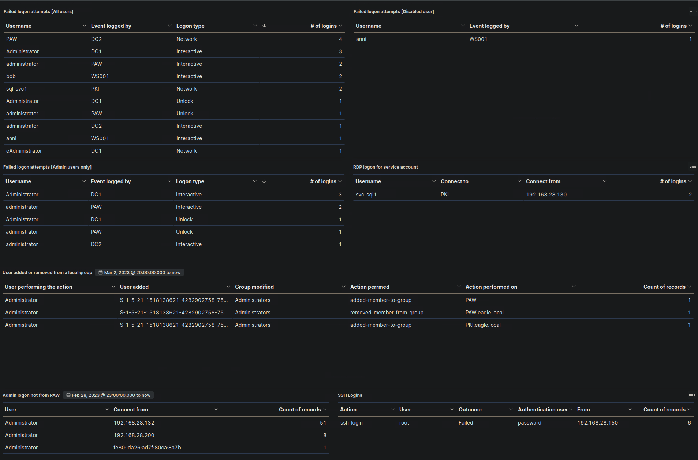

[Back to Portfolio](index.html)
# Elastic Stack

This project focuses on Security Information and Event Management (SIEM) and threat hunting using the Elastic Stack. It covers the role of a Security Operations Center (SOC), SIEM query development with KQL, and the application of the MITRE ATT&CK framework. Additionally, it explores the fundamentals of Cyber Threat Intelligence (CTI), risk assessment, and incident handling. The project includes hands-on threat hunting exercises with real-world logs, enabling the development of SIEM use cases and visualizations for effective security monitoring.

## Key Features:
- **SIEM & Elastic Stack Integration** – Developing security use cases and visualizations using the Elastic Stack
- **SOC & MITRE ATT&CK Framework** – Understanding SOC operations and applying MITRE ATT&CK techniques 
- **KQL Query Development** – Writing SIEM queries for threat detection and analysis  
- **Threat Hunting Process** – Exploring team structures, methodologies, and real-world applications  
- **Cyber Threat Intelligence (CTI)** – Analyzing different types of threat intelligence and interpreting reports 
- **Hands-On Experience** – Conducting threat hunting with real-world logs and security incidents

### **SIEM Visualization:**  

- Failed Logon Attempts (All Users)
- Failed Logon Attempts (Disabled Users)
- Successful RDP Logon Related to Service Accounts
- Users Added or Removed From a Local Group (Within a Specific Timeline)
- Failed Logon Attempts (Admin Users Only)
- Admin Logon Not From PAW
- SSH Logins


### **Thought Process & Solution Approach**  

For each hunt, I would take a structured approach, leveraging the **MITRE ATT&CK framework** to guide my investigation. Since we are using the **Elastic Stack as a SIEM**, I will use Kibana’s **Discover** feature and **KQL queries** to filter logs from **Windows Audit Logs, Sysmon, PowerShell logs, and Zeek logs**.  

---

## **Hunt 1: Detecting Lateral Tool Transfer to C:\Users\Public**  

### **MITRE ATT&CK Technique:**  
- **T1570 - Lateral Tool Transfer**  
  - Adversaries transfer tools or files between systems within a compromised environment to expand control and execute additional actions.  

### **Approach:**  
1. **Understanding the behavior**:  
   - Stuxbot is dropping malicious tools in `C:\Users\Public\`, a commonly used directory for **file staging and tool transfer** in Windows environments.  
   - Attackers often leverage this directory because it has **weaker permissions**, allowing easy access for other compromised users or processes.  

2. **Identifying relevant log sources**:  
   - **Sysmon logs** (Event ID **11**) track file creation events.  
   - The file path of interest is **C:\Users\Public\***, indicating a tool has been placed in this shared directory.  

3. **Constructing the KQL query:**  
   - Search for **file creations in `C:\Users\Public\`**  
   - Filter results using `event.code: 11` (Sysmon’s file creation event)  
   - Extract the **user.name** field to identify the user responsible for the transfer  

### **Final Query:**  
```kql
"C:\\Users\\Public*" AND event.code: 11
```  

### **Result:**  
The **user.name** field extracted from the logs shows **svc-sql1**, indicating that this service account is responsible for transferring the tool that starts with "r".  

---

## **Hunt 2: Detecting Registry Run Key Persistence**  
### **MITRE ATT&CK Technique:**  
- **T1547.001 - Boot or Logon Autostart Execution: Registry Run Keys / Startup Folder** (Adversaries use registry keys to maintain persistence)  

### **Approach:**  
1. **Understanding the behavior**: Malware modifies Windows registry run keys to execute malicious code upon system startup.  
2. **Identifying relevant log sources**:  
   - **Sysmon logs** (event code **13**) track registry modifications.  
3. **Constructing the KQL query**:  
   - Search for `event.code: 13` (registry modification event)  
   - Look specifically for registry paths related to `Run` (since these are common persistence mechanisms)  
   - Extract **registry.value** field to find the key being modified  

### **Final Query:**  
```kql
event.code: 13 AND registry.path: *Run*
```  
### **Result:**  
The first registry-based persistence action had the **registry.value**: **LgvHsviAUVTsIN**, indicating a potential malware persistence mechanism.  

---

## **Hunt 3: Detecting PowerShell Remoting for Lateral Movement**  
### **MITRE ATT&CK Technique:**  
- **T1021.006 - Remote Services: PowerShell Remoting** (Adversaries use PowerShell Remoting for lateral movement)  

### **Approach:**  
1. **Understanding the behavior**:  
   - The malware leverages **PowerShell Remoting (Enter-PSSession)** to move laterally and access **domain controllers (DC1)**.  
2. **Identifying relevant log sources**:  
   - **PowerShell logs (Event ID 4104)** track script block executions, including **Enter-PSSession**.  
3. **Constructing the KQL query**:  
   - Search for **Enter-PSSession** within PowerShell script execution logs  
   - Filter results using `event.code: 4104` (PowerShell script block logging)  
   - Extract **winlog.user.name** field to find which user initiated the connection  

### **Final Query:**  
```kql
powershell.file.script_block_text: *Enter-PSSession* AND event.code: 4104
```  
### **Result:**  
The extracted **winlog.user.name** field shows **svc-sql1**, indicating this user executed PowerShell Remoting for lateral movement toward **DC1**.  

---
