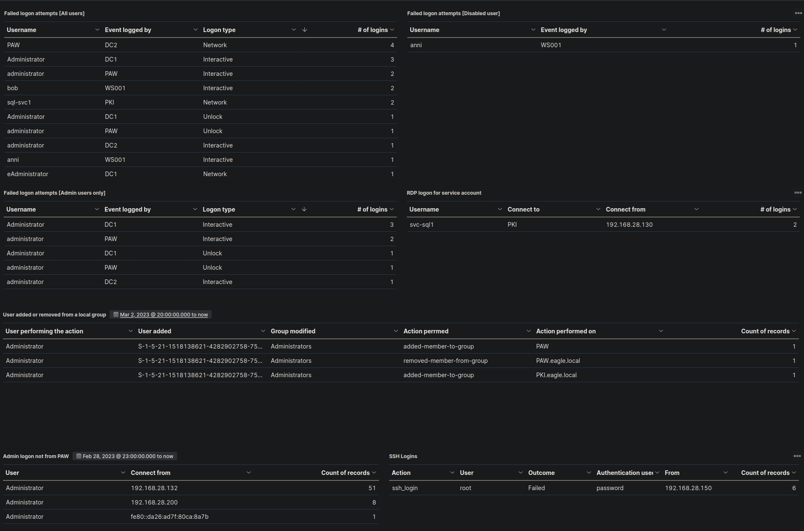

# Kibana Project

This project focuses on Security Information and Event Management (SIEM) and threat hunting using the Elastic Stack. It covers the role of a Security Operations Center (SOC), SIEM query development with KQL, and the application of the MITRE ATT&CK framework. Additionally, it explores the fundamentals of Cyber Threat Intelligence (CTI), risk assessment, and incident handling. The project includes hands-on threat hunting exercises with real-world logs, enabling the development of SIEM use cases and visualizations for effective security monitoring.

## Key Features:
- **SIEM & Elastic Stack Integration** – Developing security use cases and visualizations using the Elastic Stack
- **SOC & MITRE ATT&CK Framework** – Understanding SOC operations and applying MITRE ATT&CK techniques 
- **KQL Query Development** – Writing SIEM queries for threat detection and analysis  
- **Threat Hunting Process** – Exploring team structures, methodologies, and real-world applications  
- **Cyber Threat Intelligence (CTI)** – Analyzing different types of threat intelligence and interpreting reports 
- **Hands-On Experience** – Conducting threat hunting with real-world logs and security incidents

### **SIEM Visualization:**  

- Failed Logon Attempts (All Users)
- Failed Logon Attempts (Disabled Users)
- Successful RDP Logon Related to Service Accounts
- Users Added or Removed From a Local Group (Within a Specific Timeline)
- Failed Logon Attempts (Admin Users Only)
- Admin Logon Not From PAW
- SSH Logins

[Back to Portfolio](index.html)
